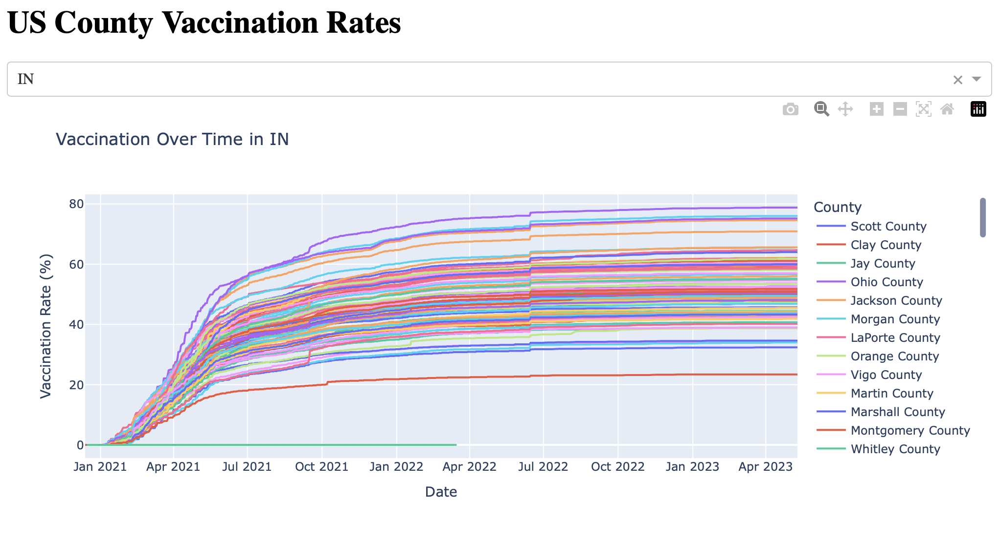

# 💉 COVID-19 Vaccination Rate Dashboard

A simple interactive dashboard built in **Python**, **Dash**, and **Plotly** to visualize vaccination rates across U.S. counties.

---

## Features

- Loads local CSV data (`vaccinations.csv`)
- Interactive dropdown to filter by state
- Dynamic line chart showing vaccination trends by county

---

## Run Locally

```bash
git clone https://github.com/ColeSweeney/COVID-Vaccine-Dashboard.git
cd COVID-Vaccine-Dashboard
python3 -m venv .venv
source .venv/bin/activate   # On Windows: .venv\Scripts\activate
pip install -r requirements.txt
python app.py
```

## 📸 Example


